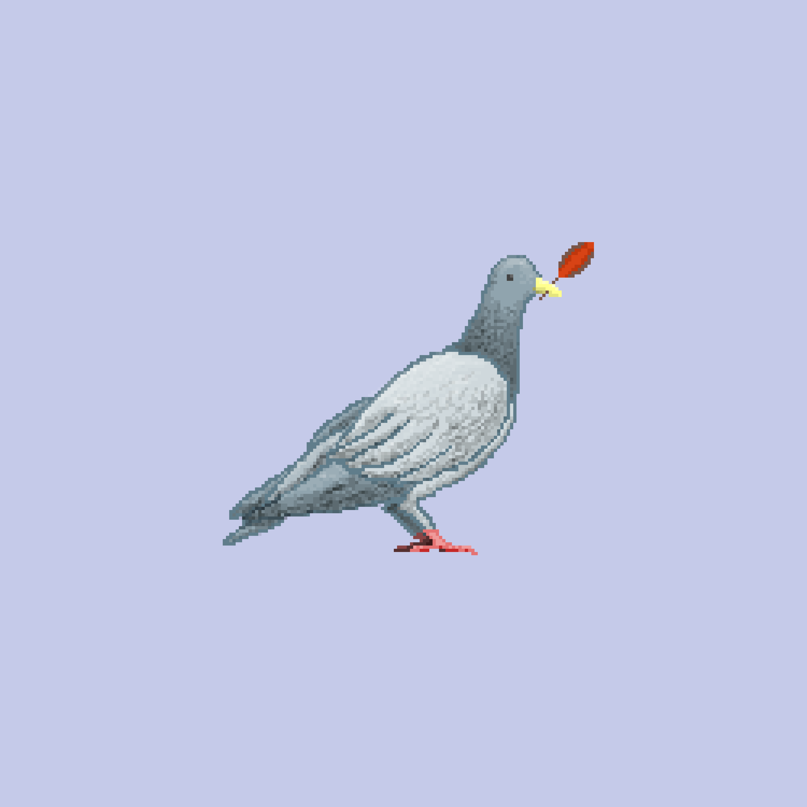

<!-- omit in toc -->
# PROJECT

[Badges](https://shields.io/)

Link to site: [Site](https://example.com)

---

PROJECT is a ____________ that does ________________. Lorem ipsum dolor sit amet, consectetur adipiscing elit. Aenean finibus tellus ac nunc aliquet suscipit. Fusce ultricies in est et aliquam. Suspendisse sit amet mattis nisi. Vivamus mauris ante, ullamcorper et libero suscipit, tempus mollis ante. Interdum et malesuada fames ac ante ipsum primis in faucibus. Vestibulum purus erat, iaculis sit amet auctor at, lobortis sed purus. Nulla dignissim lorem ac risus elementum facilisis. Ut ac diam sapien. Mauris in lacinia magna. Integer laoreet blandit odio non tincidunt. Sed iaculis efficitur fermentum. Ut sagittis sapien in urna porta, id pretium magna iaculis. Aenean faucibus suscipit odio sed fringilla.

<!-- omit in toc -->
## Table of Contents 📖

- [Features ✨](#features-)
- [Technologies ⚙️](#technologies-️)
- [Installation 🛠](#installation-)
- [Deploy 🚀](#deploy-)
  - [Development 📝](#development-)
  - [Production 🖥](#production-)
- [Contributing 👥](#contributing-)
- [Authors & Acknowledgements 🎉](#authors--acknowledgements-)
- [License 📄](#license-)
- [CHEAT SHEET](#cheat-sheet)
  - [Text](#text)
  - [Lists & Tables](#lists--tables)
  - [Code formatting](#code-formatting)
  - [Links](#links)
  - [Embedded Images](#embedded-images)
    - [Pure Markdown](#pure-markdown)
    - [HTML](#html)

## Features ✨

- Lorem
- Ipsum
- Dolor

## Technologies ⚙️

## Installation 🛠

## Deploy 🚀

### Development 📝

### Production 🖥

## Contributing 👥

## Authors & Acknowledgements 🎉

## License 📄

<!-------------------------------------------------------------->

## CHEAT SHEET

### Text

This is *italic* text.

This is **bold** text.

This is ***bold and italic*** text.

This is ~~strike through~~ text.

This is a [link](example.com)

This is an email <jeanchoiii@gmail.com>

[emojis](https://unicode.org/emoji/charts/full-emoji-list.html) are valid! Press `Ctrl + Cmd + Space` to open emoji keyboard on MacOS.

> This is
>
> a block quote

---

### Lists & Tables

- [x] Banana
- [x] Apple
- [ ] Durian

1. First item
2. Second item
   1. Second item's child

- First item
- Second item
  - Second item's child

1. First item
   - I don't have an order!

- First item
  1. I have an order!

| Left   | Center  | Right   |
| :---   |  :---:  |    ---: |
| Hi     | Hola    | 안녕     |
| Ciao   | Bonjour | Aloha   |

---

### Code formatting

in-line code: `print("This is code")`

syntax highlighted block code:

```json
{
  "note": "this is json specific code"
}
```

---

### Links

Section [link](https://google.com)

Relative path [link](path/to/file/readme.md)

---

### Embedded Images

#### Pure Markdown

From external resource:


From relative path:


#### HTML

From external resource:

- Advantage: can customize properties
- Disadvantage: Use of HTML is not ideal

<p align="center">
  
</p>
